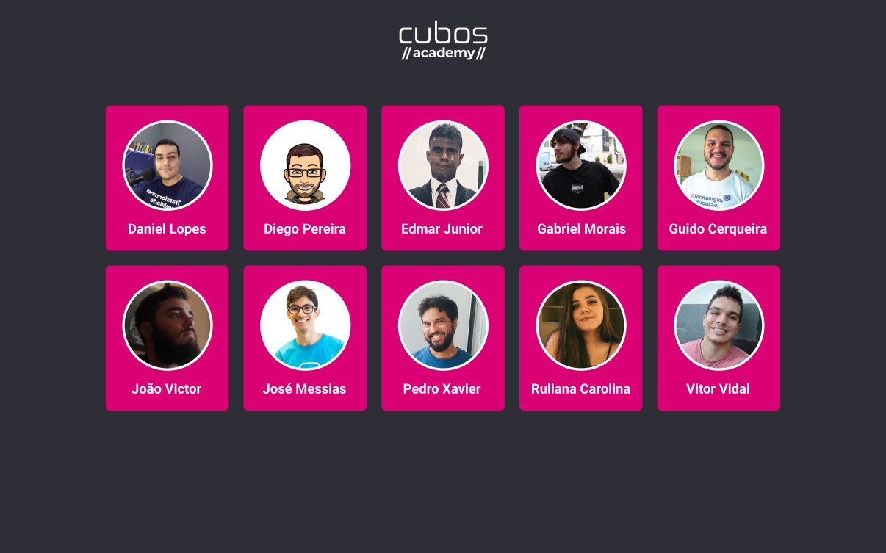
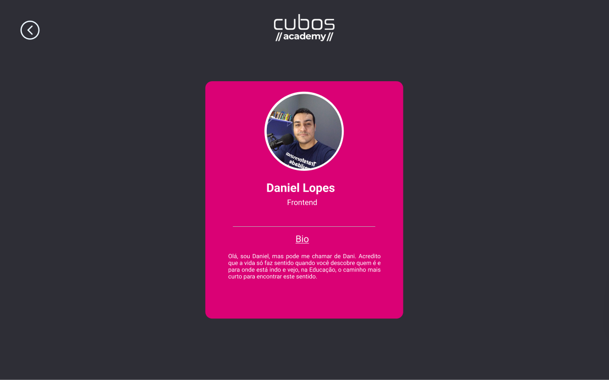

<h1 align="center"> Páginas com professores </h1>

Esse projeto se trata de uma página onde você faz o login e tem acesso a cards com os professores da Cubos Academy. Ao clicar você consegue mais detalhes do professor escolhido.

  <a href="#-tecnologias">Tecnologias</a>&nbsp;&nbsp;&nbsp;|&nbsp;&nbsp;&nbsp;
  <a href="#-projeto">Projeto</a>&nbsp;&nbsp;&nbsp;|&nbsp;&nbsp;&nbsp;
  <a href="#-layout">Layout</a>&nbsp;&nbsp;&nbsp;

 

  
  

## 🚀 Tecnologias

Esse projeto foi desenvolvido com as seguintes tecnologias:

- ReactJS
- HTML e CSS
- JavaScript
- Git e Github

## 💻 Projeto

Esse projeto se trata de um página onde você faz o login e tem acesso a cards com os professores da Cubos Academy. Ao clicar você consegue mais detalhes do professor escolhido.
Nesse projeto foi aplicado o BrowserRouter do React-Router-Dom para login e transição entre páginas.

## 🔖 Layout

Você pode visualizar o layout do projeto através [DESSE LINK](https://www.figma.com/file/VglM7jQaRe8i9qAsHst4gL/figma?t=vQQABvRCWKlGp2SZ-1). É necessário ter conta no [Figma](https://figma.com) para acessá-lo.